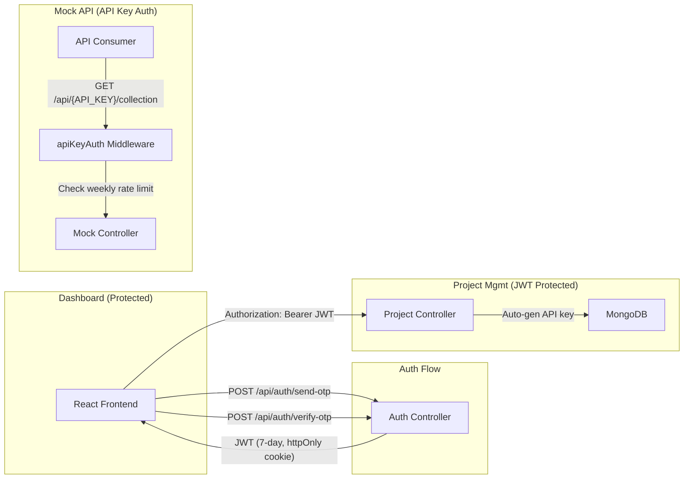

# Email OTP Auth + API Key Authentication + Weekly Rate Limiting

Add email OTP-based login/signup with 7-day persistent sessions, per-project API keys for mock route authentication, weekly rate limiting per API key, and a 3-project-per-user limit.

## Architecture Overview



## Design Decisions

**Auth strategy**: Email OTP (no passwords). User enters email → receives 6-digit OTP → verifies → gets a JWT stored as an httpOnly cookie (7-day expiry). Simple, secure, no password storage.

**OTP delivery**: Using **Nodemailer** with Gmail SMTP (or any SMTP provider). OTPs are stored in MongoDB with a 5-minute TTL index for auto-cleanup.

**Session persistence**: JWT in an httpOnly, secure cookie with a 7-day `maxAge`. The frontend sends `credentials: 'include'` on every request. No token refresh mechanism needed — user re-authenticates after 7 days.

**Mock API auth**: API keys live in the URL (`/api/:apiKey/:collection`). The `apiKeyAuth` middleware validates the key and checks the weekly rate limit before forwarding to the mock controller. This path does NOT require JWT — it's a public API authenticated solely by the API key.

**Weekly rate limit**: Default 500 requests/week per API key. Stored directly on the Project document. Uses a rolling 7-day window from `weekStart` — auto-resets when a new week begins. On API key reset, `requestCount` and `weekStart` are preserved.

**3-project limit**: Enforced per-user. The `createProject` controller counts projects owned by `req.user._id` before allowing creation.

---

## Proposed Changes

### Backend — New Dependencies

---

Install via `npm install`:
- `jsonwebtoken` — JWT generation and verification
- `nodemailer` — SMTP email sending for OTP delivery
- `cookie-parser` — Parse cookies from incoming requests

---

### Backend — Environment Variables

---

#### [MODIFY] [.env](file:///c:/Users/ACER/OneDrive/Desktop/CC_ISE/CC_ISE2/backend/.env)
#### [MODIFY] [.env.example](file:///c:/Users/ACER/OneDrive/Desktop/CC_ISE/CC_ISE2/backend/.env.example)

Add:
```env
# JWT
JWT_SECRET=<random-64-char-hex-string>
JWT_EXPIRES_IN=7d

# SMTP (Gmail example)
SMTP_HOST=smtp.gmail.com
SMTP_PORT=587
SMTP_USER=your-email@gmail.com
SMTP_PASS=your-app-password

# Rate Limit
WEEKLY_RATE_LIMIT=500
```

---

### Backend — Data Models

---

#### [NEW] [User.js](file:///c:/Users/ACER/OneDrive/Desktop/CC_ISE/CC_ISE2/backend/models/User.js)

```js
const userSchema = new mongoose.Schema({
    email: {
        type: String,
        required: true,
        unique: true,
        lowercase: true,
        trim: true,
    },
    createdAt: { type: Date, default: Date.now },
});
```

Minimal model — no password field since we use OTP-only auth.

---

#### [NEW] [Otp.js](file:///c:/Users/ACER/OneDrive/Desktop/CC_ISE/CC_ISE2/backend/models/Otp.js)

```js
const otpSchema = new mongoose.Schema({
    email: { type: String, required: true, lowercase: true },
    code: { type: String, required: true },
    createdAt: { type: Date, default: Date.now, expires: 300 }, // 5-min TTL
});
```

MongoDB TTL index auto-deletes expired OTPs. No manual cleanup needed.

---

#### [MODIFY] [Project.js](file:///c:/Users/ACER/OneDrive/Desktop/CC_ISE/CC_ISE2/backend/models/Project.js)

Add these fields:
```js
owner: {
    type: mongoose.Schema.Types.ObjectId,
    ref: 'User',
    required: true,
    index: true,
},
apiKey: {
    type: String,
    unique: true,
    required: true,
    index: true,
},
weeklyRateLimit: {
    requestCount: { type: Number, default: 0 },
    weekStart: { type: Date, default: Date.now },
    limit: { type: Number, default: 500 },
},
```

- `owner` links the project to a user (enables per-user project limit)
- `apiKey` is a UUID v4, auto-generated on creation
- `weeklyRateLimit` tracks usage for the rolling 7-day window

---

### Backend — Auth System

---

#### [NEW] [authController.js](file:///c:/Users/ACER/OneDrive/Desktop/CC_ISE/CC_ISE2/backend/controllers/authController.js)

Three endpoints:

| Endpoint | Description |
|---|---|
| `POST /api/auth/send-otp` | Takes `{ email }`, generates 6-digit OTP, stores in DB, sends via Nodemailer |
| `POST /api/auth/verify-otp` | Takes `{ email, otp }`, verifies, creates User if new, returns JWT in httpOnly cookie |
| `POST /api/auth/logout` | Clears the JWT cookie |
| `GET /api/auth/me` | Returns the current authenticated user from the JWT (used by frontend to check session) |

**OTP flow**:
1. Generate a random 6-digit numeric code
2. Delete any existing OTPs for that email (prevent spam)
3. Save new OTP doc (5-min TTL)
4. Send email via Nodemailer
5. On verify: check code matches, create/find User, sign JWT, set cookie

---

#### [NEW] [authRoutes.js](file:///c:/Users/ACER/OneDrive/Desktop/CC_ISE/CC_ISE2/backend/routes/authRoutes.js)

```js
router.post('/send-otp', sendOtp);
router.post('/verify-otp', verifyOtp);
router.post('/logout', logout);
router.get('/me', authMiddleware, getMe);
```

---

#### [NEW] [auth.js](file:///c:/Users/ACER/OneDrive/Desktop/CC_ISE/CC_ISE2/backend/middleware/auth.js)

JWT verification middleware:
1. Extract JWT from `req.cookies.token`
2. Verify with `jsonwebtoken`
3. Look up user in DB
4. Attach `req.user` or return 401

Applied to all `/api/projects/*` routes to protect the dashboard API.

---

### Backend — API Key System

---

#### [NEW] [apiKeyAuth.js](file:///c:/Users/ACER/OneDrive/Desktop/CC_ISE/CC_ISE2/backend/middleware/apiKeyAuth.js)

Middleware for mock API routes (`/api/:apiKey/:collection`):

```
1. Extract apiKey from req.params
2. Find project by apiKey
3. Check weeklyRateLimit:
   - If (now - weekStart) >= 7 days → reset counter, update weekStart
   - If requestCount >= limit → return 429
4. Increment requestCount atomically
5. Attach req.project for downstream use
```

This does NOT require a JWT — API keys are standalone auth for mock consumers.

---

#### [NEW] [apiKeyController.js](file:///c:/Users/ACER/OneDrive/Desktop/CC_ISE/CC_ISE2/backend/controllers/apiKeyController.js)

| Endpoint | Description |
|---|---|
| `POST /api/projects/:id/reset-key` | Generate new API key, **preserve** `weeklyRateLimit` data (requestCount + weekStart are NOT reset), return new key |

---

### Backend — Existing File Modifications

---

#### [MODIFY] [server.js](file:///c:/Users/ACER/OneDrive/Desktop/CC_ISE/CC_ISE2/backend/server.js)

- Add `cookie-parser` middleware
- Mount auth routes: `app.use('/api/auth', authRoutes)`
- Protect project routes with `auth` middleware: `app.use('/api/projects', authMiddleware, projectRoutes)`
- Change mock route mount from `/mock` → mount under `/api` with API key pattern
- Keep existing IP-based rate limiter as a general safety net

---

#### [MODIFY] [projectController.js](file:///c:/Users/ACER/OneDrive/Desktop/CC_ISE/CC_ISE2/backend/controllers/projectController.js)

- **`createProject`**: Generate API key (`uuid.v4()`), set `owner: req.user._id`, enforce 3-project limit (count by owner), include `apiKey` in response
- **`getAllProjects`**: Filter by `owner: req.user._id` (users only see their own projects), include `apiKey` and rate limit data
- **`getProject`**: Verify `project.owner == req.user._id`, include `apiKey` and rate limit info
- **`deleteProject`**: Verify ownership before deleting

---

#### [MODIFY] [projectRoutes.js](file:///c:/Users/ACER/OneDrive/Desktop/CC_ISE/CC_ISE2/backend/routes/projectRoutes.js)

Add:
```
POST /:id/reset-key  →  apiKeyController.resetApiKey
```

---

#### [MODIFY] [mockRoutes.js](file:///c:/Users/ACER/OneDrive/Desktop/CC_ISE/CC_ISE2/backend/routes/mockRoutes.js)

Change route patterns to include `apiKey` parameter and apply `apiKeyAuth` middleware:
```
GET    /:apiKey/:collection       → getRecords
GET    /:apiKey/:collection/:id   → getRecords
POST   /:apiKey/:collection       → createRecord
PUT    /:apiKey/:collection/:id   → updateRecord
DELETE /:apiKey/:collection/:id   → deleteRecord
```

---

#### [MODIFY] [mockController.js](file:///c:/Users/ACER/OneDrive/Desktop/CC_ISE/CC_ISE2/backend/controllers/mockController.js)

- Use `req.project` (set by `apiKeyAuth` middleware) instead of looking up by `basePath`
- Remove the redundant `Project.findOne({ basePath })` in each handler

---

#### [MODIFY] [requestLogger.js](file:///c:/Users/ACER/OneDrive/Desktop/CC_ISE/CC_ISE2/backend/middleware/requestLogger.js)

- Update URL pattern detection from `/mock/` to `/api/`
- Use `req.project` (set by `apiKeyAuth`) to get the project ID directly, instead of doing a separate DB lookup

---

### Frontend — Auth System

---

#### [NEW] [AuthContext.jsx](file:///c:/Users/ACER/OneDrive/Desktop/CC_ISE/CC_ISE2/frontend/src/context/AuthContext.jsx)

React context providing:
```js
{
    user,           // current user object or null
    loading,        // true while checking session
    login(email),   // trigger OTP send
    verifyOtp(email, otp),  // verify and set user
    logout(),       // clear session
}
```

On mount: calls `GET /api/auth/me` to restore session from cookie. If valid, sets `user`. If 401, sets `user = null` (show login page).

---

#### [NEW] [ProtectedRoute.jsx](file:///c:/Users/ACER/OneDrive/Desktop/CC_ISE/CC_ISE2/frontend/src/components/ProtectedRoute.jsx)

Wrapper component that:
- Shows a loader while `loading` is true
- Redirects to `/login` if `user` is null
- Renders children if authenticated

---

#### [NEW] [LoginPage.jsx](file:///c:/Users/ACER/OneDrive/Desktop/CC_ISE/CC_ISE2/frontend/src/pages/LoginPage.jsx)

Two-step form:
1. **Step 1**: Email input → "Send OTP" button → calls `/api/auth/send-otp`
2. **Step 2**: 6-digit OTP input → "Verify" button → calls `/api/auth/verify-otp`

Premium dark-themed design matching the existing UI. Features:
- Email validation
- OTP countdown timer (resend after 60s)
- Animated transitions between steps
- Success toast on login

---

### Frontend — Existing File Modifications

---

#### [MODIFY] [App.jsx](file:///c:/Users/ACER/OneDrive/Desktop/CC_ISE/CC_ISE2/frontend/src/App.jsx)

- Wrap everything with `<AuthProvider>`
- Add `/login` route → `<LoginPage />`
- Wrap dashboard routes with `<ProtectedRoute>`

---

#### [MODIFY] [Navbar.jsx](file:///c:/Users/ACER/OneDrive/Desktop/CC_ISE/CC_ISE2/frontend/src/components/Navbar.jsx)

- Show user email when logged in
- Add logout button
- Hide nav links when not authenticated

---

#### [MODIFY] [api.js](file:///c:/Users/ACER/OneDrive/Desktop/CC_ISE/CC_ISE2/frontend/src/services/api.js)

- Add `withCredentials: true` to axios instance (for cookies)
- Add auth API calls: `sendOtp`, `verifyOtp`, `logout`, `getMe`
- Add `resetApiKey(projectId)` call
- Update `testMockEndpoint` to use new URL format

---

#### [MODIFY] [Dashboard.jsx](file:///c:/Users/ACER/OneDrive/Desktop/CC_ISE/CC_ISE2/frontend/src/pages/Dashboard.jsx)

- Show "X/3 projects used" indicator
- Disable "New Project" button at 3 projects with tooltip
- Show API key snippet on each project card

---

#### [MODIFY] [CreateProject.jsx](file:///c:/Users/ACER/OneDrive/Desktop/CC_ISE/CC_ISE2/frontend/src/pages/CreateProject.jsx)

- Check project count on mount → redirect if limit reached
- Display the generated API key after successful creation (modal or inline)

---

#### [MODIFY] [ProjectDetail.jsx](file:///c:/Users/ACER/OneDrive/Desktop/CC_ISE/CC_ISE2/frontend/src/pages/ProjectDetail.jsx)

Major additions:
- **API Key card**: Masked by default (`sk-****...****`), click to reveal, copy button
- **Reset API Key button**: Confirmation modal warning that old key will stop working
- **Rate Limit widget**: Progress bar showing `requestCount / limit` used this week, week reset date
- **Updated endpoint URLs**: Display `/api/{apiKey}/collection` format

---

#### [MODIFY] [ProjectCard.jsx](file:///c:/Users/ACER/OneDrive/Desktop/CC_ISE/CC_ISE2/frontend/src/components/ProjectCard.jsx)

- Show small rate limit usage bar
- Show truncated API key

---

#### [MODIFY] [EndpointCard.jsx](file:///c:/Users/ACER/OneDrive/Desktop/CC_ISE/CC_ISE2/frontend/src/components/EndpointCard.jsx)

- URLs now use `/api/:apiKey/...` format

---

#### [MODIFY] [ApiTester.jsx](file:///c:/Users/ACER/OneDrive/Desktop/CC_ISE/CC_ISE2/frontend/src/pages/ApiTester.jsx)

- Default URL uses new `/api/:apiKey/...` pattern

---

#### [MODIFY] [index.css](file:///c:/Users/ACER/OneDrive/Desktop/CC_ISE/CC_ISE2/frontend/src/index.css)

New styles for:
- **Login page**: Centered card, OTP digit inputs, animated step transitions
- **API key display**: Monospace masked field, reveal toggle, copy button
- **Rate limit bar**: Gradient progress bar with percentage label
- **Project limit badge**: "2/3 used" pill
- **User menu**: Email display + logout in navbar

---

## File Change Summary

| Category | File | Action |
|---|---|---|
| **Models** | `User.js` | NEW |
| | `Otp.js` | NEW |
| | `Project.js` | MODIFY — add `owner`, `apiKey`, `weeklyRateLimit` |
| **Controllers** | `authController.js` | NEW |
| | `apiKeyController.js` | NEW |
| | `projectController.js` | MODIFY — ownership, limits, API key gen |
| | `mockController.js` | MODIFY — use `req.project` |
| **Middleware** | `auth.js` | NEW — JWT verification |
| | `apiKeyAuth.js` | NEW — API key + rate limit check |
| | `requestLogger.js` | MODIFY — new URL pattern |
| **Routes** | `authRoutes.js` | NEW |
| | `projectRoutes.js` | MODIFY — add reset-key |
| | `mockRoutes.js` | MODIFY — apiKey param |
| **Server** | `server.js` | MODIFY — cookies, auth routes, mount changes |
| **Config** | `.env` / `.env.example` | MODIFY — add JWT, SMTP, rate limit vars |
| **Frontend** | `AuthContext.jsx` | NEW |
| | `ProtectedRoute.jsx` | NEW |
| | `LoginPage.jsx` | NEW |
| | `App.jsx` | MODIFY — auth provider, protected routes |
| | `Navbar.jsx` | MODIFY — user info, logout |
| | `api.js` | MODIFY — auth calls, credentials |
| | `Dashboard.jsx` | MODIFY — project limit indicator |
| | `CreateProject.jsx` | MODIFY — limit check |
| | `ProjectDetail.jsx` | MODIFY — API key card, rate limit widget |
| | `ProjectCard.jsx` | MODIFY — rate limit bar |
| | `EndpointCard.jsx` | MODIFY — new URL format |
| | `ApiTester.jsx` | MODIFY — new URL format |
| | `index.css` | MODIFY — login, API key, rate limit styles |

---

## Open Questions

> [!WARNING]
> **Weekly rate limit default** — I'll use **500 requests/week** per API key as the default. Is that acceptable, or would you prefer a different number?

> [!WARNING]
> **SMTP credentials** — You'll need to provide Gmail app password (or another SMTP service) credentials in `.env` for OTP emails to work. I'll add placeholder values in `.env.example`.

---

## Verification Plan

### Automated Tests
1. **Auth flow**: `POST /api/auth/send-otp` → verify OTP doc in DB → `POST /api/auth/verify-otp` → check JWT cookie set → `GET /api/auth/me` returns user
2. **Project limit**: Create 3 projects → 4th returns 403
3. **API key auth**: `GET /api/:validKey/:collection` → 200, `GET /api/invalid-key/:collection` → 401
4. **Rate limit**: Hit endpoint 500+ times → 429
5. **Key reset**: Reset key → old key returns 401, new key returns 200, rate data preserved
6. **Frontend**: Login page renders, OTP flow works, dashboard shows after login, protected routes redirect

### Manual Verification
- Full end-to-end: Sign up → create 3 projects → test mock API with API key → exhaust rate limit → reset key → verify old key dies, new key works with same count → close browser, reopen → session persists for 7 days
